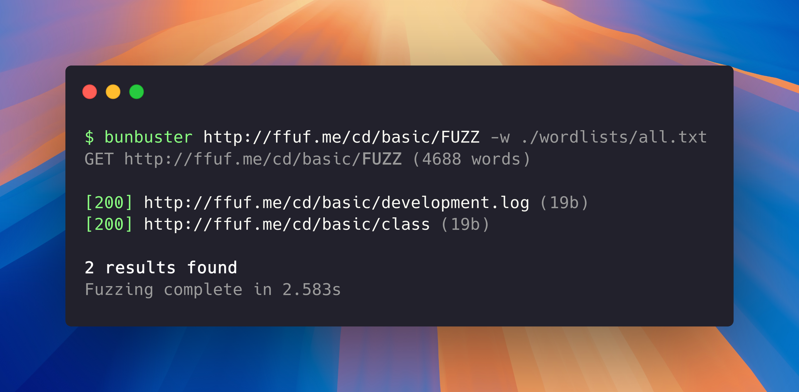
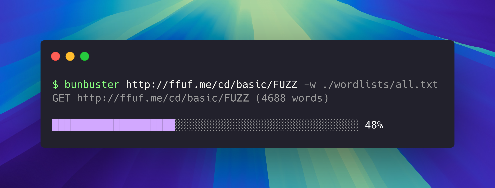

# BunBuster
## Ridiculously fast web & TCP fuzzer designed for brute-forcing directories, subdomains, and files on web servers.

Up to **3.5%** faster than ffuf and fully built with Bun.




<small>* Without using artificial ratelimits, and in my own testing. Might vary depending on your machine.</small>

## Installation

### Prebuilt Executable

Go to the [releases page](https://github.com/tiagorangel1/bunbuster/releases) and download the latest version for your platform.

Make sure it has executable permissions (`chmod +x bunbuster-xxxxxxx`) and to add it to PATH, or else you'll have to cd into the executable's folder and use `./bunbuster` instead of `bunbuster`.

### From Source

Clone the repo, `bun install` and then `bun run build`

## Features

- **Super fast**:
  - Optimized for speed, multi-threaded by default.
  - Built with Bun
  - 3.5% faster than ffuf
- **Extensible**:
  - Fully-fledged TCP support
  - Fuzz by path, subdomains, parameters, request body, headers and more
- **Filtering**:
  - Filter responses by size
  - Filter responses by status code
- **Very customizable**:
  - Custom headers
  - Custom methods
  - Fully configurable request parameters
  - Use fuzzing in any request parameter, URL, paths, subdomains and more.
- **Bypass ratelimits**:
  - Built-in rate limit detection and evasion by using a backoff delay.
  - Configurable request throttling by using the `requests per minute` config.
  - Simple IP spoofing by setting a randomized `X-Forwarded-For`/`X-Real-IP` header
  - Built-in timeout handling
- **And more**:
  - Export as CSV
  - View request sizes
  - Easy to understand docs
  - Very simple to use UI


> Note: As all other web fuzzers, you'll need a wordlist. You can download sample ones from the `assets/wordlists` folder in this repo.

***


<center>
<b>Speed comparison: Time to run a full scan</b><br>
<small>on <code>http://ffuf.me/cd/basic/FUZZ</code>, default settings, same wordlist (7530 words)</small>
</center>

## Usage

```bash
bunbuster <url> [options]
```

Run `bunbuster --help` to see all of the available arguments and options.

## Examples

### Basic
```bash
bunbuster http://ffuf.me/cd/basic/FUZZ -w ./wordlists/common.txt
```

### FUZZ between extension and path
```bash
bunbuster http://ffuf.me/cd/ext/logs/FUZZ.log -w ./wordlists/common.txt
```

### FUZZ in parameters
```bash
bunbuster http://ffuf.me/cd/param/data?FUZZ=1 -w ./wordlists/parameters.txt
```

### Set ratelimiting
```bash
bunbuster http://ffuf.test/cd/rate/FUZZ -w ./wordlists/common.txt -rpm 3000 # 50 req/s
```

### Automaric ratelimit detection
```bash
bunbuster http://ffuf.test/cd/rate/FUZZ -w ./wordlists/common.txt
# note that -rpm is not set
```

### Subdomain Discovery
```bash
bunbuster https://FUZZ.example.com -w ./wordlists/subdomains.txt
```

### Custom Headers
```bash
bunbuster https://api.example.com/FUZZ \
  -w ./wordlists/all.txt \
  -o '{"headers": {"Authorization": "Bearer TOKEN"}}'
```

## Roadmap
These features aren't currently implemented but they might be comming soon.
* Different wordlists that match to different keywords, e.g.
```bash
bunbuster https://$FUZZ1.example.com/$FUZZ2 -w "./wordlists/subdomains.txt, ./wordlists/common.txt"
```

* Ability to use with `bunx`

## Verbose logging

## Notes

- If you don't know how to use this, copy this file and give it to ChatGPT. It will tell you everything you need to know. Don't open an issue.
- Be mindful of potential IP blocking. BunBuster currently does not have support for Tor, but you can set up a VPN and it should use it too.
- As always, use this responsibly and only on systems you have explicit permission to test BunBuster is intended for security research and authorized penetration testing. Always obtain proper authorization before scanning or testing any system you do not own or have explicit permission to test.